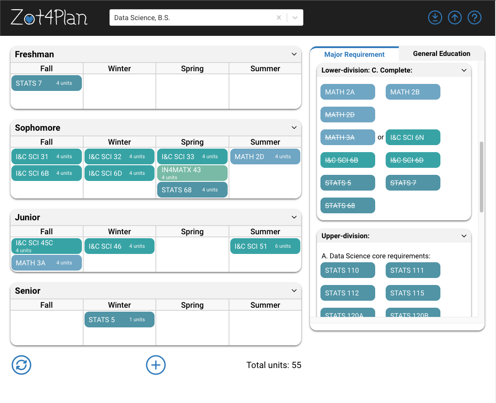

## **Zot4Plan - Undergraduate Progress Tracker**

By: [`Tram La`](https://www.linkedin.com/in/tram-la-680417200/) and [`Loc Khong`](https://www.linkedin.com/in/lockhong/)

### **Description**

---

Zot4Plan is a tool that allows Anteaters to plan out their undergraduate years. In order to make the planning process easier for users, our program will also display the ge/course requirements for the chosen major. All of the data we acquired for this program are collected from the UCI General Catalogue. Please make sure to check your schedule with your academic advisor. Thank you.

### **Features**

---

 |   | 
:--- |:----:|---:
 Required courses displayed after major selection | Users can add courses by using the search bar | Select GE courses by section

* Search bar that allows users to either select or search their major of choice (B.A., B.S., or B.F.A.)

* A calendar that displays the chosen courses, divided by quarters.

    - Users can add an additional academic year by clicking on the "+" button at the bottom of the calendar

    - The additional year can be removed by clicking on the "-" button next to the year

* Major Requirement Tab
    
    - Each dropdown represents a section in the requirement

    - Drag and drop feature that allows users to place the courses in the desired quarter(s)

    - A search engine that users can use to include any additional courses

* General Education Requirement Tab

    - 10 main dropdowns - each represents a GE section (the number of required courses is also included)

    - A combination of dropdown and search bar is implemented to help users find their courses in an efficient manner

* Card pop-up that exhibits necessary information of that particular course

    - Course name

    - Course description

    - Unit(s)

    - Prerequisite, Restriction, Corequisite, Repeatability

    - GE fulfillment

* Refresh button that allows users to remove all of the current courses on their calendar

* Save and Load Implementation

    - Users can save their calendar by selecting the download button, which the schedule will be downloaded as a json file

    - The upload feature will take a json file of the schedule and load that saved version

### **How to Run Program Locally**

---

Open 2 terminals: one is for client and the other is for server

* cd to client folder: 

    - npm install 

    - npm start

* cd to server folder: 

    - npm install

    - node server.js

### **External Libraries**

---

* Front-End

    - React-Beautiful-DnD

    - React-Redux

    - React-Select

    - React-tooltip

    - Axios 

* Back-end

    - Cors

    - Express

    - Sequelize

    - Mysql

* Collect data

    - BeautifulSoup

    - Requests

    - Json

### **Cited Sources**

---

* Axios request: [`Axios Tutorial`](https://www.bezkoder.com/axios-request/)

* NodeJs Rest APIs with Express, sequelize and MySQL: [`Node.js Rest APIs`](https://www.bezkoder.com/node-js-express-sequelize-mysql/#Test_the_APIs)

* Markdown general syntax: [`Markdown Basic Syntax`](https://www.markdownguide.org/extended-syntax/)

* Markdown table syntax: [`Markdown Extended Syntax`](https://www.markdownguide.org/extended-syntax/)
